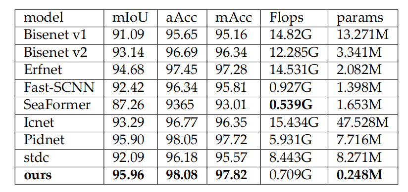

# 💬基于人像分割的实时虚拟背景替换系统
2023年春季学期，[张兆翔](https://zhaoxiangzhang.net/chinese/)老师的《模式识别与机器学习》大作业，课程最终得分96。

## 💡方法
模型结构图：

Simple Aggregation PPM, SAPPM

流对齐-注意力融合模块

UI示意图

## 📰结果
Supervise?Portrait dataset:
