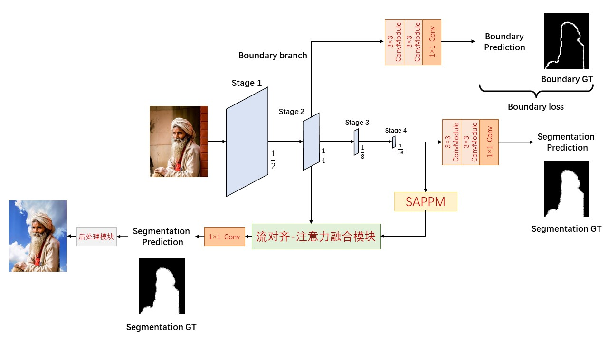
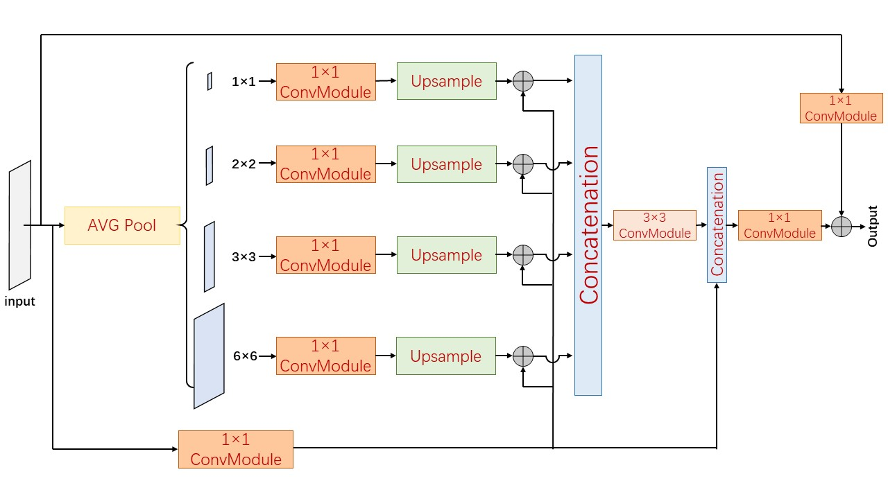
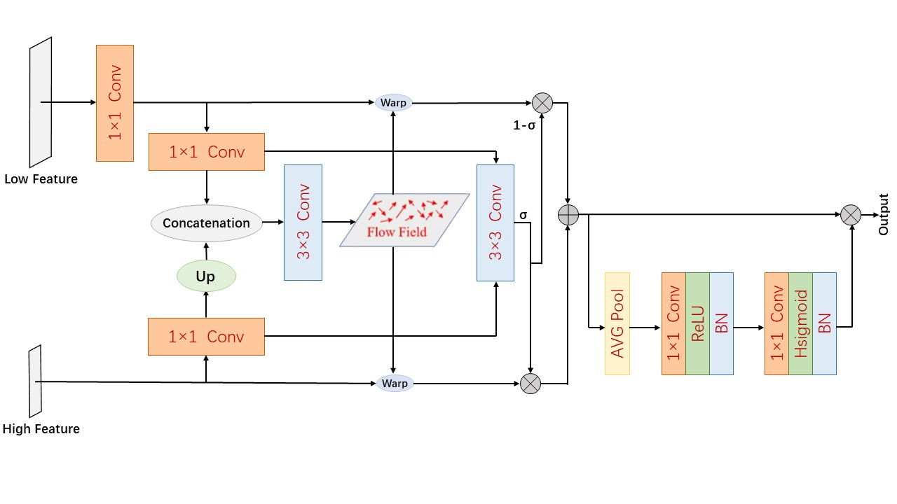
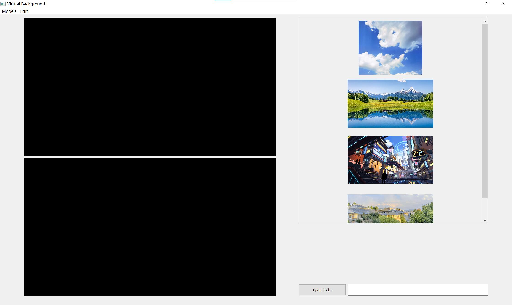

# 基于人像分割的实时虚拟背景替换系统
2023年春季学期《模式识别与机器学习》大作业，得到老师和同学的高度评价，课程最终得分96，详见报告，代码在code/路径下。

我们针对人像分割任务，设计了基于非对称编码器-解码器的模型，在Supervise-Portrait 数据集上实现了最佳的精度-效率平衡。

我们完成了完整的背景替换系统，设计了后处理模块，利用膨胀、腐蚀、光流等图像处理方法，使替换背景后的图像更加自然

模型结构图：

Simple Aggregation PPM, SAPPM

流对齐?注意力融合模块

UI示意图

